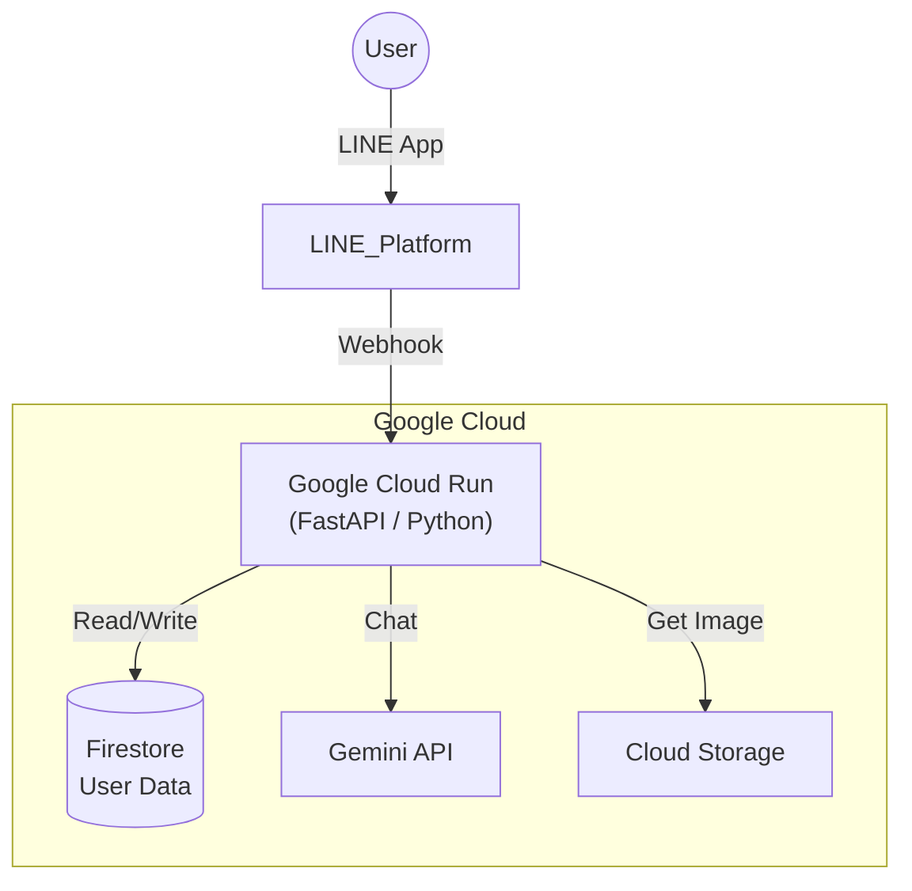

🌕 月うさぎからのおくりもの 🥕 (Moon Rabbit Bot)

毎朝の早起きを楽しく習慣化するための、LINEボット形式の育成ゲーム・コミュニケーションアプリです。
ユーザーは月うさぎの「飼い主」となり、毎日の挨拶を通じて通貨（人参）を集め、アイテム購入や着せ替えを楽しむことができます。

📱 概要 (Features)

ただの会話ボットではなく、**「データベースによるステータス管理」** と **「生成AIによる動的な会話」** を組み合わせた、ゲーム性の高いアプリケーションです。

🐰 主な機能
1.  **早起きストリーク（継続）機能**
    * 毎朝「おはよう」と挨拶することで、通貨（人参）を獲得。
    * 連続ログイン日数（ストリーク）をFirestoreで管理し、継続を応援。
2.  **月面コンビニ（ショップ機能）**
    * 貯めた人参を消費してアイテム（サングラス、染め粉、身代わり人形）を購入可能。
    * LINE Flex Messageを使用したカルーセルUIによる商品棚の実装。
3.  **着せ替えシステム**
    * 購入したアイテムに応じて、「会員証」に表示されるうさぎの画像が変化。
    * データベース上の所持品ステータスと連携した動的なUI変更。
4.  **身代わり人形（救済ロジック）**
    * ログインが途切れても、アイテムを消費して連続記録を自動で守るロジックを実装。
5.  **リアルタイム月齢計算**
    * 「おやすみ」の挨拶に対し、Pythonで現在時刻から月齢（満月・三日月など）を計算し、実際の空と同じ月を表示。
6.  **AIうさぎとの会話**
    * Google Gemini APIを活用し、特定のコマンド以外は「月のうさぎ」というペルソナ（人格）で自然な雑談が可能。

🛠️ 技術スタック (Tech Stack)

モダンなサーバーレスアーキテクチャを採用し、スケーラビリティと運用コストの最適化を図っています。

* **Language:** Python 3.11+
* **Framework:** FastAPI
* **Infrastructure:** Google Cloud Run (Serverless)
* **Database:** Google Cloud Firestore (NoSQL)
* **Storage:** Google Cloud Storage (画像ホスティング)
* **AI Model:** Google Gemini API (gemini-2.5-flash)
* **Interface:** LINE Messaging API (Flex Message)
* **Library:** firebase-admin, line-bot-sdk, pytz

## 🏗️ アーキテクチャ (Architecture)

💡 こだわったポイント

* **ステータス管理の厳密さ:**
    * 「人参が足りない時は買えない」「既に持っているアイテムは二重購入させない」といった条件分岐を実装し、データの整合性を保っています。
* **UX（ユーザー体験）の向上:**
    * テキストだけでなく、Flex Messageを活用して視覚的に楽しめる「会員証」や「ショップ」を作成しました。
* **ハイブリッドな応答システム:**
    * 「コマンド（ショップ、会員証）」と「AIによる自由会話」を共存させ、実用性とエンターテイメント性を両立させました。
* **セキュリティ:**
    * APIキーなどの機密情報は環境変数（Environment Variables）で管理し、コード上には一切ハードコーディングしていません。

📸 スクリーンショット

| 会員証 | ショップ画面 |
| :---: | :---: |
|  |  |

🚀 今後の展望
* ユーザーランキング機能の実装
* レベルアップ機能の実装
* 季節限定アイテムの追加

---
Created by miki-mini